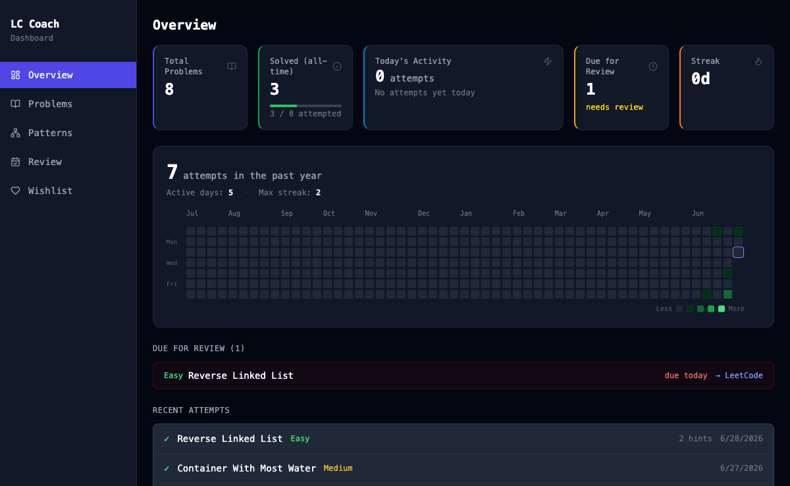
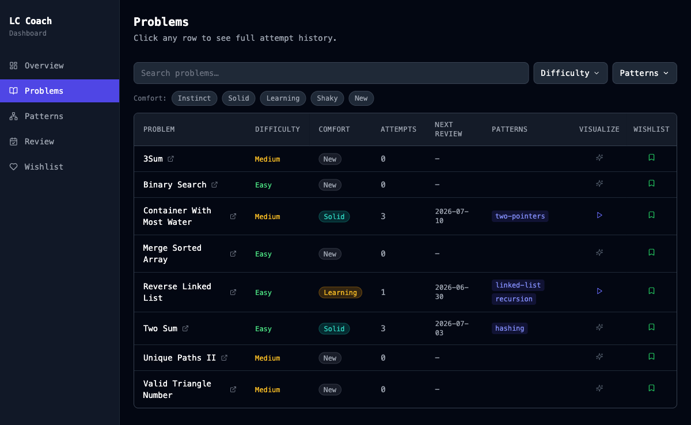
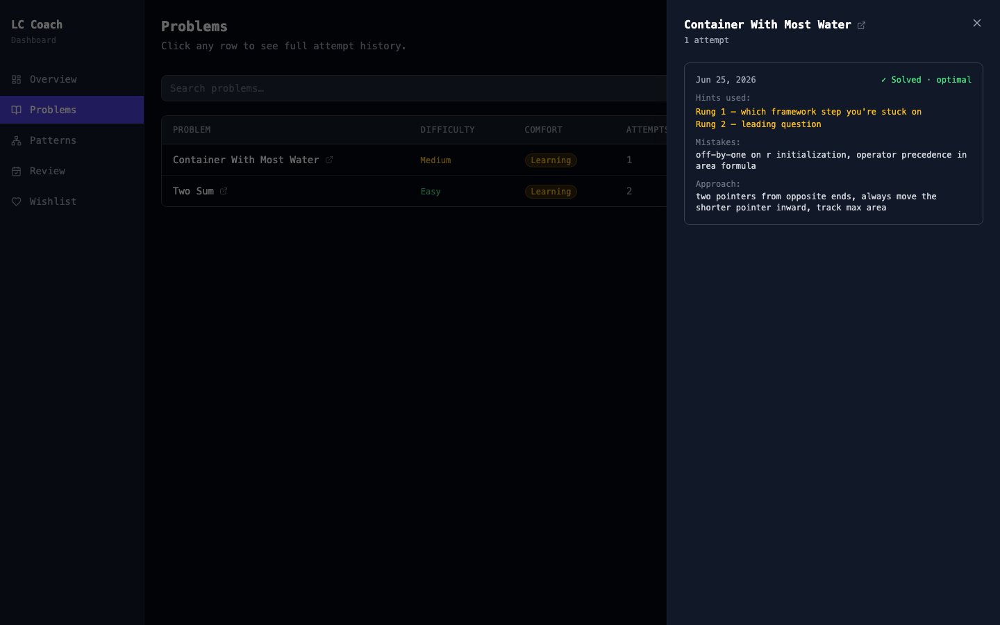
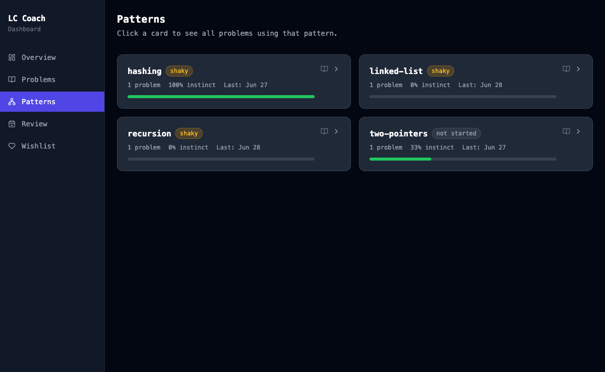
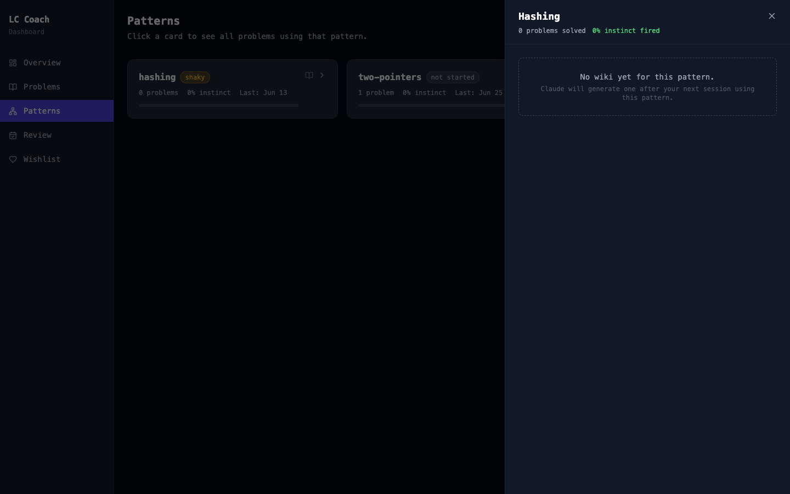
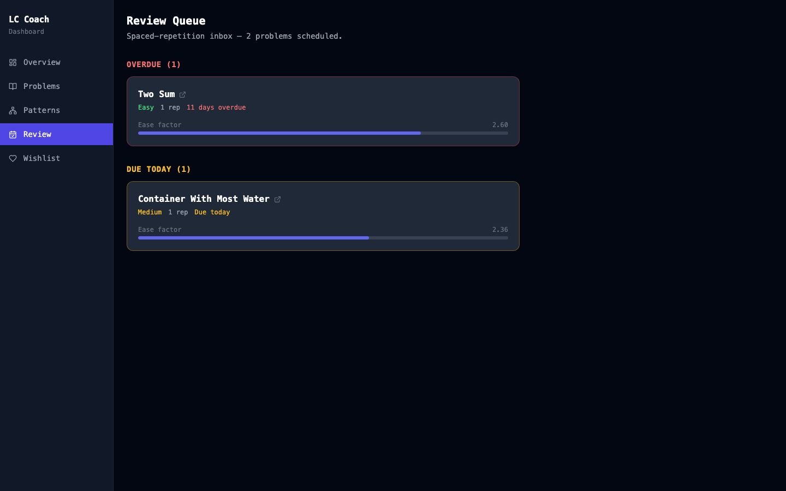
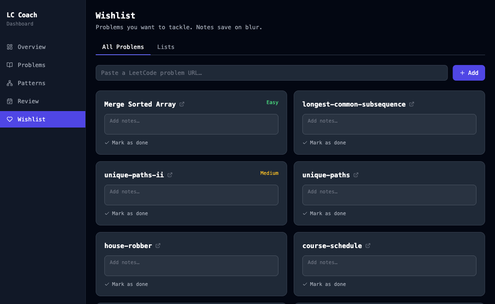

<div align="center">

# LeetCode Coach

**Stop peeking at solutions. Build the instinct.**

[](https://github.com/vashihatej/leetcode-coach/actions/workflows/ci.yml)



</div>

---

## Why this exists

Most people prepare for coding interviews by watching solution videos and reading editorials. It feels productive — you understand the solution while you're reading it. But understanding a solution and being able to *find* one from scratch are completely different skills. When the interview starts and the page is blank, that feeling comes back.

LeetCode Coach is built around a different idea: the only way to build interview instincts is to practice finding answers yourself, repeatedly, with just enough guidance to keep moving. It uses Claude (or any AI tool you prefer) as a Socratic coach — it asks questions, points at what you're missing, and never hands you the answer. Every session gets logged: what hints you needed, where you got stuck, what analogy finally made it click. That history compounds. Patterns you've genuinely internalized space out in your review queue. Patterns that are still shaky come back sooner.

## Features

- 🤖 **Socratic coaching** — the AI asks questions, never gives answers
- 📋 **Five-step framework** — restate → examples → brute force → bottleneck → pattern
- 💡 **Analogy-based explanations** — every concept gets a real-world hook
- 📊 **Pattern mastery tracking** — not started / shaky / solid, per pattern
- 🔁 **SM-2 spaced repetition** — review queue that adapts to how well you know each problem
- 📖 **Pattern wiki** — auto-generated knowledge cards with recognition signals, invariant, template code, and common traps
- 📝 **Rich attempt history** — aha moments, confusion points, analogy that clicked, visualization links
- 🎬 **Animated visualizations** — step-through animations built during coaching sessions (two-pointer, recursion tree, linked list reversal, and more)
- ✨ **AI viz generation** — click the sparkle button on any problem to have Claude generate a custom visualization on the fly
- 📈 **GitHub-style activity heatmap** — 5-level green palette, month/day labels, today ring, and a Less → More legend
- 🔌 **Chrome extension** — streams your live LeetCode problem, code, and run/submit results directly into the coaching session

## Quick Start

```bash
git clone https://github.com/vashihatej/leetcode-coach
cd leetcode-coach
npm run setup
npm start
```

Open **http://localhost:8765** in your browser.

> `npm run setup` installs all dependencies and builds the dashboard. You only need to run it once (and again after pulling changes that modify `dashboard/`).

## Chrome Extension

The extension is what makes coaching feel seamless. Without it you paste the problem manually; with it, everything syncs automatically.

**What it does:** When you open a LeetCode problem, the extension captures the problem statement, your code, and your run/submit results, and sends them to `session.md` on the local server. Your AI coach reads that file and knows exactly what you're working on without you having to explain anything.

**Install:**
1. Open `chrome://extensions`
2. Enable **Developer mode** (top right toggle)
3. Click **Load unpacked** and select the `extension/` folder in this repo
4. Open any LeetCode problem — the extension icon should show **Connected ✓**

**Troubleshooting:**
- *Not connected:* make sure `npm start` is running before opening LeetCode
- *Wrong port:* the extension talks to `localhost:8765` by default — if you changed `COACH_PORT`, update `extension/manifest.json` `host_permissions` to match

## Using with AI tools

### Claude Code (recommended)

1. Install [Claude Code](https://claude.ai/code)
2. Open a terminal in this repo and run `claude`
3. The coaching skill at `.claude/skills/leetcode-coaching/` loads automatically
4. Open a LeetCode problem in Chrome (extension installed + server running)
5. Say: *"let's work on this problem"*

The coach reads your current session, asks what came to mind first, and guides you from there.

### Codex

1. Point Codex at this repo root
2. The skill file is at `.claude/skills/leetcode-coaching/SKILL.md` — add it to your Codex context or system prompt
3. Open a LeetCode problem and ask Codex to coach you through it
4. Paste `session.md` contents if the extension isn't syncing automatically

### Cursor / other AI tools

Copy the contents of `.claude/skills/leetcode-coaching/SKILL.md` into your tool's system prompt or rules file. The skill is plain markdown with no Claude-specific syntax — it works with any instruction-following model.

## How it works

```
LeetCode tab
    │
    │  (content scripts)
    ▼
Chrome Extension  ──POST /api/session──▶  Node server (port 8765)
                                               │
                                          session.md  ◀── AI coach reads this
                                               │
                                    node src/cli/coach.js log-attempt
                                               │
                                           coach.db  (SQLite)
                                               │
                                     http://localhost:8765
                                           (dashboard)
```

**Components:**

| Path | Role |
|---|---|
| `src/server/` | Express API + serves dashboard + viz files |
| `src/db/` | SQLite schema, all queries, SM-2 spaced repetition |
| `src/cli/` | CLI — log-attempt, mastery, enrich-pattern, review-due |
| `dashboard/` | React/Vite SPA (built into `public/dashboard/`) |
| `extension/` | Chrome extension MV3 — content scripts + popup |
| `public/viz/` | Standalone animated algorithm visualizations |
| `.claude/skills/` | The coaching skill (plain markdown, works with any AI tool) |

## Dashboard

### Overview
GitHub-style activity heatmap (53-week grid, 5-level green palette, month labels, Mon/Wed/Fri day labels, today ring, Less → More legend), stats bar (streak, total solved, active days), upcoming reviews, and a recent attempts drawer you can click into for full session details.


### Problems
Every problem you've attempted, with comfort badges, pattern tags, next review date, and two action columns:

- **Visualize** — `▶` plays a saved visualization; `✦` (sparkle) calls Claude to generate one on the fly, saves it to `public/viz/`, and links it to the problem automatically.
- **Wishlist** — bookmark any problem to revisit it later.



Click any row to open the attempt drawer — full history with hints used, mistakes, aha moments, the analogy that clicked, and a link to the visualization if one was built.



### Patterns
Your mastery grid across every pattern you've encountered. Each card shows problem count, instinct-fire rate, and a progress bar.



Click the `📖` icon to open the **Pattern Wiki** — a knowledge card the AI generates automatically the first time it coaches you through a problem using that pattern. Contains recognition signals, the core invariant, an analogy, a Python template, common traps, and related patterns.



### Review Queue
Problems due for spaced repetition, sorted by urgency. The ease bar shows how comfortably you know each one.



### Wishlist
Problems you want to do but haven't started. Paste a LeetCode URL and it populates the title and difficulty automatically. Add notes for why you added it.



## Visualizations

With the server running, open any of these directly in your browser:

| Visualization | URL |
|---|---|
| Two pointers — sorted array | `http://localhost:8765/viz/two-pointer-sorted.html` |
| Recursion tree — subsets | `http://localhost:8765/viz/recursion-subsets.html` |
| Reverse linked list — iterative | `http://localhost:8765/viz/reverse-linked-list-iterative.html` |
| Container with most water | `http://localhost:8765/viz/container-with-most-water.html` |

Each viz is a standalone HTML page with step-through controls (← → keys or play button), a code panel highlighting the active line, a live state table, and a note for each step. Built with the shared `viz-kit.js` + `viz-kit.css`.

The coach builds new visualizations automatically during a session — saved to `public/viz/` and linked from the attempt history. You can also trigger generation manually from the Problems dashboard using the `✦` button.

## CLI Reference

All commands run from the repo root:

```bash
# Show the current problem + code (from Chrome extension)
node src/cli/coach.js status

# Show per-pattern mastery
node src/cli/coach.js mastery

# Show problems due for review
node src/cli/coach.js review-due

# Update mastery for a pattern
node src/cli/coach.js set-mastery --pattern "sliding window" --level solid

# Log an attempt after a coaching session
node src/cli/coach.js log-attempt \
  --slug two-sum \
  --solved \
  --result optimal \
  --patterns "hashing" \
  --hints 1,2 \
  --mistakes "forgot to check complement before inserting" \
  --approach "one-pass complement map" \
  --aha "realized I need O(1) lookup, not O(n) scan" \
  --confusion "initially tried sorting which breaks index requirement" \
  --analogy "labeled lockers — go straight to the slot instead of checking every one" \
  --viz-path "viz/two-sum-hashmap.html"

# Generate a pattern knowledge card
node src/cli/coach.js enrich-pattern \
  --pattern "two-pointers" \
  --description "..." \
  --signals "find pair with target,sorted array,two ends" \
  --invariant "..." \
  --analogy "..." \
  --template "l, r = 0, len(arr)-1\nwhile l < r:\n    ..." \
  --time-complexity "O(n)" \
  --space-complexity "O(1)"

# Check if a pattern has a wiki entry
node src/cli/coach.js pattern-wiki-status --pattern "two-pointers"
```

## Data

- `coach.db` — SQLite database: problems, attempts, patterns, review queue, pattern wiki
- `session.md` — current problem state (overwritten by extension on each change)

Both are local and gitignored. Your data never leaves your machine.

## Contributing

See [CONTRIBUTING.md](CONTRIBUTING.md). Good first contributions: new visualizations, new CLI flags, dashboard improvements, and richer coaching skill analogies. PRs that add external dependencies or break the local-only model won't be accepted.
